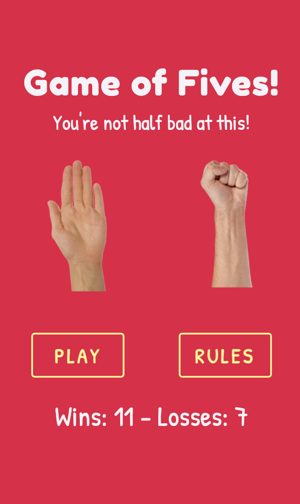
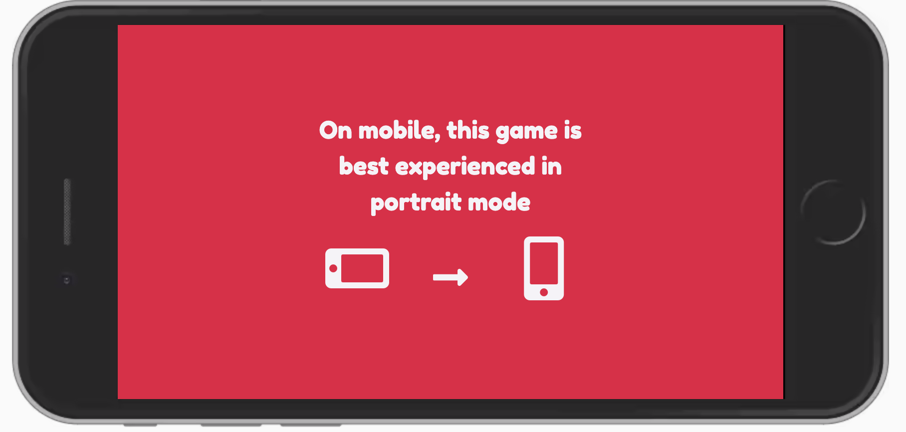
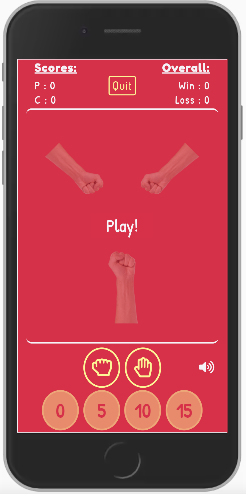
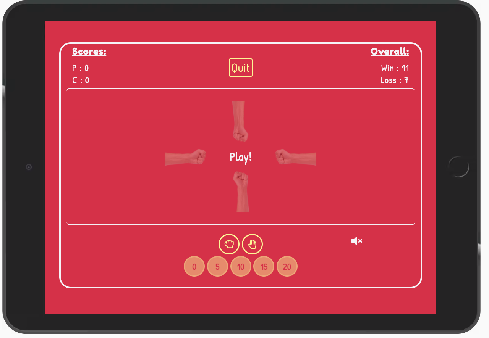
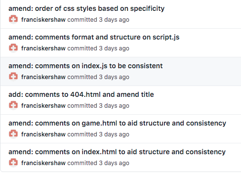

# Game of Fives!
## Code Institute's Milestone Project 2 - Interactive Front-End

Game of Fives is an online game of chance that has players assessing the odds against the computer in order to win points and measure their success over multiple plays. Based loosely on the real life drinking game, players take turns with their computer opponent in guessing the correct total from multiples of five. This total changes depending on what the player and computer choose to display out of zero (a balled up fist) or five (an open palm), with points awarded when the guess is correct. My aim with this project is to create a fun and memorable game that captures the essence of the loud, rowdy drinking game while being an enjoyable means of procrastination online.

This project is the second of four ‘milestone’ projects which are required to complete the Code Institute’s diploma in full stack web development. Assessment criteria for this milestone project focuses on the ability to produce an interactive front-end site that responds to users’ actions and inputs using previously learnt HTML, CSS and Javascript.

You can view the live website [here](https://franciskershaw.github.io/game-of-fives/index.html), and a link to the github repository can be found [here](https://github.com/franciskershaw/game-of-fives).

## Table of Contents

* [UX](#ux)
    * [User Stories](#user-stories)
* [Planning and Design](#planning-and-design)
    * [Strategy Plane](#strategy-plane)
    * [Scope Plane](#scope-plane)
    * [Structure Plane](#structure-plane)
    * [Skeleton Plane](#skeleton-plane)
    * [Surface Plane](#surface-plane)
        * [Colour Scheme](#colour-scheme)
        * [Typography](#typography)
* [Features](#features)
    * [Existing Features](#existing-features)
    * [Features left to implement](#features-left-to-implement)
* [Technologies used](#technologies-used)
    * [Languages and frameworks](#languages-and-frameworks)
    * [Additional tools](#additional-tools)
* [Git commit messages](#git-commit-messages)
* [Testing](#testing)
* [Deployment](#deployment)
* [Cloning](#cloning)
* [Credits](#credits)
    * [Media](#media)
    * [Acknowledgements](#acknowledgements)

## UX

My main goals for the creation of this website were as follows:
* Create a fun game that is enjoyable to play and functions completely as intended.
* Create a game that produces a positive user response from both its gameplay and general aesthetics.
* Demonstrate my new found competence in applying Javascript and jQuery to independently coded projects (alongside previously learnt HTML and CSS) so as to meet the pass criteria of the Code Institute for this milestone project.

### User Stories

#### Project Stakeholder

As the owner of the site:

1. I want the site to be eye-catching to look at so that users are left with a positive emotional response and return to the site.
2. I want users to enjoy the game so that they might recommend it to other people and come back to play more.
3. I want the site to function properly and as intended so that I can pass this part of the course.

#### Users

As a player:

1. I want to enjoy playing the game so that I can justify procrastinating in this way.
2. I want the site navigation to be intuitive so that I can find the game or instructions quickly.
3. I want instructions that explain how to play the game if I don’t know already so that I can quickly learn how to get started.
4. I want the game to provide feedback to me during play so that I know when it’s my go, whether I’ve chosen correctly or incorrectly, and what my current score is vs the computer.
5. I want to choose the level of difficulty to play on so I can test myself on harder difficulties.
6. I want my wins and losses to be recorded so that when I return to the site I can see historically how successful I am at this game.
7. I want the game to load quickly and respond properly to my interactions as I expect them to.

## Planning and Design

### Strategy Plane

The **user stories** as detailed in the previous section formed the first part of the development process and was very helpful in deciding which features were critical to the success of the site. Features that I did not deem necessary to myself (as the stakeholder) and the players reaching the end of their journeys would not be considered.

The **focus** of the project is:
* To create a fun interactive game using JavaScript which allows all users to reach the end of their respective stories with ease.

The **business goal** for the stakeholder:
* To have a game that players will want to return to. 
* Produce a project which passes all marking criteria for the Code Institute's milestone 2 project.

*Therefore, to meet both the focus and business goals, the game must be created and hosted on a bespoke website using HTML, CSS and Javascript in order to implement all the necessary functionality to both entertain the user and pass this part of the course.*

While strategising for this project, I figured that a prudent place to start for inspiration on layout and features would be to look up some popular online versions of 'rock, paper, scissors', as it essentially amounts to a more basic version of 'Game of Fives'. With this in mind, I found the following resources very useful to begin with:

* [Afiniti - Rock, Paper, Scissors](https://www.afiniti.com/corporate/rock-paper-scissors)
* [Online Stopwatch - Rock Paper Scissors!](https://www.online-stopwatch.com/chance-games/rock-paper-scissors/)
* [Rock, Paper, Scissors - JS Tutorial by DevEd](https://www.youtube.com/watch?v=qWPtKtYEsN4&ab_channel=DevEd)

Using the below importance vs viability metric, I listed out the opportunities on offer when creating the game to help decide which ones were achievable, relevant and appropriate with regard to my user stories.

| Opportunity | Importance	 | Viability 
| ----------- | ----------- | ------------
| Game vs 1 computer player | 5 | 5
| Option to increase difficulty | 3 | 4
| Explanation of the rules | 4 | 5
| Wins vs losses record | 3 | 4
| Sound effects | 3 | 3
| Mute option | 3 | 3
| Option to play against a human player | 2 | 1
| **Total** | 23 | 25

From this research, I concluded that the features I wanted to implement into Game of Fives were mostly viable when compared to their importance in this project. However, it became clear early on that I would not be able to add functionality allowing players to compete against other human players. While this would have been a really exciting prospect, implementation of this option would have been beyond my current coding capabilities and comparatively not as important for the completion of my other user journeys.

 ### Scope Plane

Based on information I uncovered during the strategy plane, and considering any limitations of my current coding abilities, the features I decided were critical for the game to include are as follows:

#### Required functional specifications
* Choice of difficulty setting
* Section explaining the rules
* Dedicated area for gameplay
* User feedback for a successful or unsuccessful round, as well as victory or defeat
* Visible representation of current scores
* Visible representation of historic wins vs losses record
* Sound effects

#### Content requirements
* Design of game must be aesthetically pleasing and easy to navigate
* Game must load quickly
* Rules must be brief but clear
* Game must contain no logic errors
* Scores must update when points are won
* Overall scores must update when a game ends 
* The game has to remember the user's overall win/loss rate for future visits
* User must be able to mute sounds if they want to

### Structure Plane

Bearing in mind the functional specifications and content requirements outlined in the scope plane, I decided only two unique pages were needed for the site. These two pages share responsibility for presenting the features necessary to allow users to reach the end of their respective journeys.

1. **Homepage, containing:**
    * The game title
    * A tagline, the content of which changes depending on the user's play history
    * Hand images from the game itself
    * A play button which launches a modal offering the user different difficulty choices
    * A rules button which launches a modal and carousel explaining the rules in three slides
    * An overall wins vs loss record for returning users
    * A staggered entry animation presenting all of the above content in order of greatest impact and importance

2. **Game page, containing:**
    * Current game information, including scores and overall wins vs loss record for returning users
    * A quit button, which navigates back to the homepage
    * A game arena section where the visible gameplay can take place
    * All user inputs for the game itself
    * A mute button to switch off sound effects
    * Further play and quit *call to action* buttons once the game has ended

#### Interaction Design

While the user stories are varied in terms of their end destination, intended use for all visitors to the site is ultimately going to be to play the game itself. Therefore the interaction design needed to be kept very simple to allow intuitive navigation to and from the game page, via the rules section should they wish.

* Interaction design needs to be intuitively learnable.
* Buttons and game inputs must provide feedback to ensure users are aware they can or have been clicked.
* The same colour scheme and general tone has to be maintained across the pages and modals to maintain consistency.
* 404 page required in the event that the user types the incorrect URL, with a link back to safety.

#### Information Architecture
* Navigation should be non-linear, achieved through clear and obvious buttons that both take a user forward or backwards in their journey without the use of the browser's forward and back controls.
* Hub and spoke structure seems most appropriate on this occasion without the need for a conventional navigation bar, as the homepage can act as the hub with all spokes (rules modal, difficulty modal and game page) having a route back to the hub via either a back or a quit button.
* All information should fit within the viewport of a given device, without the need to scroll at all.
* No user should be clicking more than three times to reach the end of their user journey.

### Skeleton Plane

In order to properly visualise how my pages would be organised and linked together, I created some low fidelity mockups using [InVision](https://www.invisionapp.com/) - focussing on the design layout for small, medium and large screen sizes. The purpose of this process was to double check that the ideas I had begun formulating internally during the structure plane would be faithful to the user stories they were designed to fulfil. Any clear issues flagged up at this stage could then be fixed well before coding of the site started in earnest. In fact, this project made it very clear to me how important this stage of development is, as I started wireframing the game in landscape mode before quickly realising that there would be no room on mobile for all of the required features.

Simplicity was at the forefront of my mind when making my designs, as I wanted to keep the layout of my site as user-friendly and intuitive as possible.

#### Changes from skeleton plane to final result

For the most part, I felt satisfied at this stage that all my user stories would be completed intuitively through the layout of my site and began coding the game. However, some design issues came to light once development started:

* Difficulty modal: my original design had the number selections moving to left/right from up/down at the largest screen sizes. In practice, this was a pointless responsive feature that actually looked worse than simply following the same layout on all sizes, **so I reverted the layout back to its default view**.

* Rules modal: my original designs had the carousel controls appearing on the left and right of each slide's content, however in practice the size of the information was too large when legible to share the space with the controls, **so I moved them to the bottom of the modal's body to compensate.**

### Surface Plane

Once strategising and wireframing was complete, I could move onto planning how the look and feel of the game and site in general would appear. Early on during development, I had decided that I wanted the general tone of the site to be associated with the following keywords:

* Playful 
* Rowdy
* Fast-paced

These buzzwords led me to conclude that I would need the site's typography and colouring to be bright and striking, almost as if aimed at a younger audience.

#### Colour Scheme

I chose to employ bright and garish colours for the game, in keeping with the playful tone I was hoping to instill. 

Using [Coolors](https://coolors.co/) I was able to generate and tweak my colour pallette to this specification:

* #EC0B43 red: This provides the background colour to both the homepage and the game page.
* #58388E purple: This provided the background in the rules modal to allow sufficient contrast with the main page.
* #FFF689 yellow: This was employed on the majority of interactable content across the site.
* #F6F3F7 white: This was used for all not-interactive text content on the homepage, as well as the game information and game arena on the game page.

#### Typography

I chose to use the cartoonish 'Fredoka One' for the main headings, a font which sets the tone for what the user will expect from the rest of the site: a slightly juvenile game that isn't intended to be taken too seriously! 

For the rules section, it was important that I chose something legible and undistracting while not looking out of place in the playful tone I had set. After quite a bit of deliberation, I settled upon 'Dosis' from google fonts to handle this task.

Until relatively late in development, I was using 'Dosis' for the rest of my site's content - for example on the homepage's tagline and for the game buttons. However I concluded that 'Dosis' was not playful and cartoonish enough, as per the buzzwords I was aligning this project to. The 'Patrick Hand' font from Google Fonts fixed this and is far more appropriate for the tone of the game.

## Features

### Existing features

#### index.html

* Two images of hands (one balled up fist and one open palm) make an entrance via a primitive stop motion inspired entry animation, followed by the title of the game.
* A tagline appears beneath the heading which changes depending on the user's past performances: 'Get stuck into your first game!' for those who haven't played a game yet, 'You're not half bad at this!' if the user has won more than they've lost, 'It's neck and neck!' if the user has won as many as they've lost, and 'You're not great at this.' if the user is losing overall.
* Two buttons appear beneath or sandwiched in between the hands (depending on the screen size): a play button and a rules button.
* The play button launches a modal which offers the user a choice of difficulty settings. Each button is an anchor tag which will direct the user to the game page.
* The rules button launches a modal with a nested carousel containing three explanatory slides for users who are not aware of the rules yet.
* Beneath all the main content is a small section containing the user's win/loss history.

 

In the unlikely event that mobile users are in landscape mode when entering the site's homepage, an overlay appears to warn users that the should be sticking to portrait mode to best enjoy the game:

The overlay returns to the screen if the user changes from portrait to landscape on the homepage, to reiterate that the game is not to be played in landscape mode.

#### game.html

The game page is designed as an arena of sorts, with three clearly defined areas:

* Game information area
* Gameplay area
* User inputs area

On mobile the content takes all of the space on the viewport. However once tablet size has been reached this changes to fill only about 80%, leaving empty space around the playable area.

 

The game information area contains: 
* The current game scores, which update when the user or computer score points.
* The overall win vs loss record, which updates at the end of each game. 
* A quit button that redirects to the home page at any stage should the user wish to leave.

The gameplay area contains: 
* The user and the computer's hand images. The amount of computer hand images visible is dictated by which button the user clicked on the homepage's difficulty selection modal. 
* Game text content placed between the user and computer hand images which changes to give user feedback when needed.

The user input area contains two rows of clickable buttons: 

* Row one contains two fist and palm font awesome icons which allow the user to decide whether they will present a zero or a five in the forthcoming round. 
* Row two is enabled only on the user's turn, and contains the buttons necessary for a user to make an educated guess as to what the total score will be. This row again changes depending on which difficulty the user has previously selected, as the possible answers will increase if there are more computer players present.
* A mute button is clearly visible to the right of the inputs which allows the user to turn off the sound effects if they wish. Local storage then remembers this choice so that the user does not have to keep muting every time they visit if that is their preference. *Note - sounds are muted by default on iOS devices due to a bug detected in testing. Please see testing.md for more information in **notable bugs**.*

### Gameplay

Once the page loads:

* The text in the middle of the gameplay area reminds the user that to win a game you need to score 3 points.
* A 3,2,1 countdown then commences before any inputs are enabled.

During the game:

* The game begins with the user's turn, so that there is always a slight advantage given to the user overall.
* Once the user clicks zero (balled up fist) or five (open palm), if it's the user's turn then the hand icon inputs become disabled, while the user guess options are enabled. If it is the computer's turn to guess the total score, the round skips straight to the round's animation.
* After a guess has been clicked (or an initial top row input if it is the computer's go to guess), a stop motion inspired animation occurs counting to three before revealing what both the user and computer has decided to input as well as the guess in the middle of the court. The animation contains sound effects created by myself on each shake of a hand.
* If the user and computer are tied on two points each, then the text copy in the middle of the gameplay area changes to 'Next point wins' for further feedback.

End of the game:

* Once either the user or the computer reaches three points, the game is declared over with a message in the center of the page - 'You won!' for a user victory, or 'You lost!' for a computer victory. If sounds are on, a victory or defeat sound effect is initiated.
* The overall record in the top right of the screen is updated.
* The standard quit button is hidden and two new buttons appear in place of the user inputs, a 'Play again' option which will restart the game using the current difficulty setting, or a new 'Quit' button which returns the user to the homepage.

### Features left to implement

* One day I would love to have this game available on a network basis allowing users to challenge other human users to a game in real time. The real life game after all is not a game between user and computer, but between several human users using psychology more than luck to determine how to play their opponent.
* I also envisage eventually implementing a dedicated results page, accessible via the homepage, which goes into further detail about the user's play history, broken up organised by the various difficulty settings they have chosen to play on. At the moment this was not vital to the fulfilment of my user stories, and would make more sense once a user is able to play against other humans - as this would be a far more interesting set of results to record and analyse. 

## Technologies used

### Languages and frameworks

* **HTML5:** Language used for structure and content across both pages.
* **CSS3:** Language used to style elements from the HTML pages.
* **Bootstrap:** CSS and JavaScript framework which allowed for the quick implementation of the homepage modals and the grid system which greatly improved the responsiveness of each page.
* **JavaScript:** Programming language used to add interactivity to the homepage and implement the logic required to make the game work.
* **jQuery:** JavaScript framework which helped me select and manipulate elements with greater ease than purely through JavaScript.

### Additional Tools

* [Amiresponsive:](http://ami.responsivedesign.is/) Used to produce the hero image in README.md and check general responsiveness of the pages.
* [Favicon Generator:](https://realfavicongenerator.net/) Used to create the favicon on the browser tab.
* [FontAwesome:](https://fontawesome.com/) Large database of icons which I used for my hand icons, mute button, and orientation warning on the landscape overlay.
* [Free Formatter:](https://www.freeformatter.com/html-formatter.html) Used to help ensure code was consistently formatted across all files.
* [Github:](https://github.com/) Version control and storage of my code.
* [Gitpod:](https://gitpod.io/) Development environment where all the code was written.
* [Google Docs:](https://docs.google.com/) Used for note taking and was where much of my readme was initially written.
* Google Developer Tools: Used for debugging and testing of responsiveness across several screen sizes. Also vital to the testing of each game function as and when they were created.
* [Google Fonts:](https://fonts.google.com/) Provided my site with the 'Fredoka One', 'Patrick Hand' and 'Dosis' fonts.
* [InVision:](https://www.invisionapp.com/) Used to create all of my wireframes at the beginning of the development process.
* [removebg:](https://www.remove.bg/) Used to remove the white background from my favicon.
* [JSHint:](https://jshint.com/) Checked my javascript code was valid and error free.
* Logic Pro X: Music recording software, used to edit my sound effects down to the required length.
* [Trello:](https://trello.com/) Used to split all tasks into several sprints, to help bring the development process in line with agile principles.
* [W3C CSS Validation Service:](https://jigsaw.w3.org/css-validator/) Confirmed that my CSS is legal.
* [W3C Markup Validation Service:](https://validator.w3.org/) Confirmed that my HTML code is legal.
* [WAVE:](https://wave.webaim.org/) Allowed me to evaluate and test the accessibility of the site.
* [ZapSplat:](https://www.zapsplat.com/) Provided a small soundbite for button clicks on the game page.

## Git Commit Messages

For the commits on this project, I continued to follow the basic rules I had set during my first milestone project. That is to say:

* Start comments where possible with a prefix that summarises what the commit is for, such as fix (for bugs), add, remove, amend, style, or docs (for anything added to README.md).
* Always use the imperative tense so that readers would read as *the purpose of this commit is to* - etc.
* Commit often, and keep messages as short as possible.

Building on this format, I also added the following conditions as a result of feedback from my previous project and the different specifications required this time around:

* Include the file name being amended where possible, such as index.html or script.js.
* Use the prefix 'logic:' in any commits aimed at amending or adding in something that was specifically related to the gameplay's javascript functions.
* Use the prefix 'test:' for any commits that were being pushed specifically to test bug fixes onto the live site.

At the time of writing, these are among my recent commit messages and illustrate the format I applied for this project:

## Testing

Please see a full report of the testing applied to this project [here.](testing.md)

## Deployment

I deployed the website to GitHub Pages, which was achieved as follows:

1. View the Game of Fives repository by going to the 'Your repositories' section on Github's navigation.
2. Go to settings, which is at the far right of the repository navigation next to insights.
3. Scroll down to the GitHub Pages section.
4. Select the master branch in the Source section.

More in depth information about GitHub Pages can be found [here.](https://pages.github.com/)

## Cloning

You are more than welcome to clone my project. To do so, simply follow these steps:

1. On GitHub, navigate to the main page of the repository.
2. Click on the **Code** dropdown, located next to Add file.
    * To clone the repository using HTTPS, under "Clone with HTTPS", click the clipboard icon to copy the link.
    * To clone the repository using an SSH key, including a certificate issued by your organisation's SSH certificate authority, click Use SSH then click the clipboard icon to copy the link.
    * To clone the repository using GitHub CLI, click Use GitHub CLI, then click the clipboard icon to copy the link.
3. Open the Terminal.
4. Change the current working directory to the location where you want the cloned directory.
5. Type *git clone*, and then paste the URL you copied earlier.
6. Press **Enter** to create your local clone.

More in depth information about cloning repositories, including how to clone a repository using GitHub Desktop, can be found [here.](https://docs.github.com/en/github/creating-cloning-and-archiving-repositories/cloning-a-repository)

## Credits

### Media

* The photos of the hands used on the homepage and in gameplay were screen grabbed from the [afiniti Rock, Paper, Scissors demo](https://www.afiniti.com/corporate/rock-paper-scissors) and edited to specification using [removebg.](https://www.remove.bg/)

* Click sounds on the game page were sourced from [zapsplat.](https://www.zapsplat.com/)

* Sound effects during gameplay created by Francis Kershaw and Zoe Thexton.

### Acknowledgements

* I had help centering my landscape overlay from [this stack overflow post](https://stackoverflow.com/questions/953918/how-to-align-a-div-to-the-middle-horizontally-width-of-the-page) on the answer posted by [Peter Mortensen.](https://stackoverflow.com/users/63550/peter-mortensen)

* The entry animation on the homepage was lifted and tweaked from my Milestone 1 project, which in turn was inspired by the animations covered on [this YouTube video](https://www.youtube.com/watch?v=zHUpx90NerM&ab_channel=TraversyMedia) by [Traversy Media.](https://www.youtube.com/channel/UC29ju8bIPH5as8OGnQzwJyA)

* The transform animation that takes place each round during gameplay, and the code required to restart it each time it finishes, was learnt from [this YouTube video](https://www.youtube.com/watch?v=qWPtKtYEsN4&ab_channel=DevEd) by [Dev Ed](https://www.youtube.com/channel/UClb90NQQcskPUGDIXsQEz5Q) between 45 and 51 minutes.

* Help with the syntax needed to check width and height of window courtesy of [Zoe Thexton's](https://github.com/zoet24) MS2 [js repository.](https://github.com/zoet24/presidential-debate/blob/master/assets/js/index.js)

* I had help adding an event listener for orientation changes from [this stack overflow post](https://stackoverflow.com/questions/5498934/detect-change-in-orientation-using-javascript) on the answer posted by [mplungjan.](https://stackoverflow.com/users/295783/mplungjan)

* The code to check whether a device is using iOS (to help fix a UX issue present in certain iPhones and iPads) was found on [this stack overflow post](https://stackoverflow.com/questions/9038625/detect-if-device-is-ios) by [Pierre.](https://stackoverflow.com/users/1029952/pierre)

* Help implementing a 3,2,1 countdown before the start of each game was found on [this stack overflow post](https://stackoverflow.com/questions/31106189/create-a-simple-10-second-countdown) on the answer posted by [James McDowell.](https://stackoverflow.com/users/4815264/james-mcdowell)

* The code to randomly generate two numbers, of which one is 0, was found on [this stack overflow post](https://stackoverflow.com/questions/9730966/how-to-decide-between-two-numbers-randomly-using-javascript) on the answer posted by [Peter Olsen.](https://stackoverflow.com/users/546661/peter-olson)

* The code to sum the values of an array was found on [this stack overflow post](https://stackoverflow.com/questions/1230233/how-to-find-the-sum-of-an-array-of-numbers) on the answer by [Florian Margaine.](https://stackoverflow.com/users/851498/florian-margaine)

A huge thank you to all the people who took part in user testing, the Code Institute's Slack community, and my mentor Aaron Sinnott for advice at various stages during development of the site.

[Back to the top](#game-of-fives!)