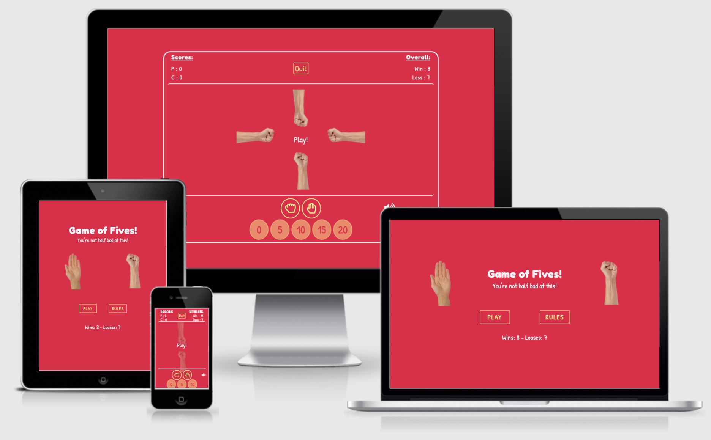
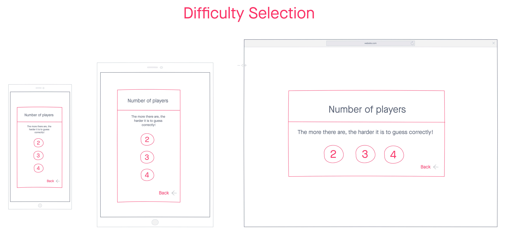

# Game of Fives!
## Code Institute's Milestone Project 2 - Interactive Front-End

Game of Fives is an online game of chance that has players assessing the odds against the computer in order to win points and measure their success over multiple plays. Based loosely on the real life drinking game, players take turns guessing the correct total in a given round from multiples of five. This total changes depending on what the player and computer choose to display out of zero (a balled up fist) or five (an open palm), with points awarded when the guess is correct. My aim with this project is to create a fun and memorable game that captures the essence of the loud, rowdy drinking game while being an enjoyable means of procrastination online.

This project is the second of four ‘milestone’ projects which are required to complete the Code Institute’s diploma in full stack web development. Assessment criteria for this milestone project focuses on the ability to produce an interactive front-end site that responds to users’ actions and inputs using previously learnt HTML, CSS and Javascript.

You can view the live website [here](https://franciskershaw.github.io/game-of-fives/index.html), and a link to the github repository can be found [here](https://github.com/franciskershaw/game-of-fives).

*Table of contents goes here*

## UX

My main goals for the creation of this website were as follows:
* Create a fun game that is enjoyable to play and functions completely as intended.
* Create a game that produces a positive user response from both its gameplay and general aesthetics.
* Demonstrate my new found competence in applying Javascript and jQuery to independently coded projects (alongside previously learnt HTML and CSS) so as to meet the pass criteria of the Code Institute for this milestone project.

### User Stories

#### Project Stakeholder

As the owner of the site:

1. I want the site to function properly and as intended so that I can pass this part of the course.
2. I want the site to be eye-catching to look at so that users are left with a positive emotional response and return to the site.
3. I want users to enjoy the game so that they might recommend it to other people and come back to play more.

#### Users

As a player:

1. I want to enjoy playing the game so that I can justify procrastinating in this way.
2. I want to be able to navigate the site intuitively to find the start button or instructions.
3. I want instructions that explain how to play the game if I don’t know already so that I can quickly learn how to get started.
4. I want the game to provide feedback to me during play so that I know when it’s my go, whether I’ve chosen correctly or incorrectly, and what my current score is vs the computer.
5. I want to choose the level of difficulty to play on so I can test myself on harder difficulties.
6. I want my wins and losses to be recorded so that when I return to the site I can see historically how successful I am at this game.
7. I want the game to load quickly and respond properly to my interactions as I expect them to.

## Planning and Design

### Strategy Plane

The **user stories** as detailed in the previous section was the first part of the development process and was very helpful in deciding which features were critical to the success of the site. Features that I did not deem necessary to myself (as the stakeholder) and the players reaching the end of their journeys would not be considered.

The **focus** of the project is:
* To create a fun interactive game which allows all users to reach the end of their respective stories with ease.

The **business goal** for the stakeholder:
* Have a game that players will want to play multiple times. 
* Produce a project which passes all marking criteria for the Code Institute's milestone 2 project.

*Therefore, to meet both the focus and business goals, the game must be hosted on a bespoke website and created using using HTML, CSS and Javascript.*

While strategising for this project, I figured that a prudent place to start for inspiration on layout and features would be to look up some popular online versions of 'rock, paper, scissors' as it essentially amounts to a more basic versio of 'Fives'. With this in mind, I found the following sites very useful to begin with:

* [Afiniti - Rock, Paper, Scissors](https://www.afiniti.com/corporate/rock-paper-scissors)
* [Online Stopwatch - Rock Paper Scissors!](https://www.online-stopwatch.com/chance-games/rock-paper-scissors/)

Using the below importance vs viability metric, I was able to list out the opportunities on offer when creating the game and decide which ones were achievable, relevant and appropriate with regard to my user stories.

| Opportunity | Importance	 | Viability 
| ----------- | ----------- | ------------
| Game vs 1 computer player | 5 | 5
| Option to increase difficulty | 3 | 4
| Explanation of the rules | 4 | 5
| Record wins vs losses record | 3 | 4
| Sound effects | 3 | 3
| Mute option | 5 | 3
| Option to play against a human player | 2 | 1
| **Total** | 25 | 25

 From this reserach, I concluded that the features I wanted to implement into Game of Fives were mostly viable when compared to their necessity in this project. However, it became clear early on that I would not be able to add functionality allowing players to compete against other human players. While this would have been a really exciting prospect, it would have likely been beyond my current coding capabilities and comparitively not as important for the completion of my user journeys.

 ### Scope Plane

Based on information I uncovered during the strategy plane, and considering any limitations of my current coding abilities, the features I decided were critical to include are as follows:

#### Required functional specifications
* Choice of difficulty setting
* Explanation of the rules
* Element of competition against another 'player'
* User feedback for a successful or unsucessful round
* Visible representation of current scores
* Visible representation of historic wins vs losses record
* Sound effects

#### Content requirements
* Design of game must be aestehtically pleasing and easy to navigate
* Game must load quickly
* Rules must be brief but clear
* Game must contain no logic errors
* Scores must update when points are won
* Overall scores must update when a game ends 
* The game has to remember the user's overall win/loss rate for future visits
* User must be able to mute sounds if they want to

### Structure Plane

Bearing in mind the functional specifications and content requirements outlined in the scope plane, I decided only two unique pages were needed for the site that would share responsibility for presenting the necessary features to allow users to reach the end of their journeys.

1. **Homepage, containing:**
    * The game title
    * A tagline whose content changes depending on the user's play history
    * Hand images from the game itself
    * A play button which launches a modal offering the user different difficulty choices
    * A rules button which launches a modal and carousel explaining the rules in three slides
    * An overall wins vs loss record for returning users
    * A staggered entry animation presenting all of the above content in order of greatest impact

2. **Game page, containing:**
    * Current game information, including scores and overall wins vs loss record for returning users
    * A quit button, which navigates back to the homepage
    * A game arena section where the visible gameplay can take place
    * All user inputs for the game itself
    * A mute button to switch off sound effects
    * Further play and quit *call to action* buttons once the game has ended

#### Interaction Design

While the user stories are varied in terms of their end destination, intended use for all visitors to the site is ultimately going to be to play the game I have provided. Therfore the interaction design should be kept very simple to allow intuitive navigation to and from the game page, via the rules section should they wish.

* Interaction design needs to be intuitively learnable
* Buttons and game inputs must provide feedback to ensure users are aware they can or have been clicked
* The same colour scheme and general tone has to be maintained across the pages and modals to maintain consistency
* 404 page required in the event that the user types the incorrect URL, with a link back to safety

#### Information Architecture
* Navigation should be non-linear, achieved through clear and obvious buttons that both take a user forward or backwards in their journey without the use of the browser's forward and back controls
* Hub and spoke structure seems most apprpriate on this occasion without the need for a conventional navigation bar, as the homepage can act as the hub with all spokes (rules modal, difficulty modal and game page) having a route back to the hub via some kind of exit or quit button
* All information should fit within the viewport of a given device, without the need to scroll at all
* No user should be clicking more than three times to reach the end of their user journey

### Skeleton Plane

In order to properly visualise how my pages would be organised and linked together, I created some low fidelity mockups using [InVision](https://www.invisionapp.com/) - focussing on the design layout for small, medium and large screen sizes. The purpose of this process was to double check that the ideas I had begun formulating internally during the structure plane would be faithful to the user stories they were designed to fulfil. Any clear issues flagged up at this stage could then be fixed well before coding of the site started in earnest - case in point being that I started wireframing the game in landscape mode before quickly realising that there would be no room on mobile for all of the the required features.

Simplicity was at the forefront of my mind when making my designs, as I wanted to keep the layout of my site as user-friendly and intuitive as possible. For me, the main goals of this site would have been threatened by any kind of overcomplicated or unconventional design as the end desitination.

#### Changes from skeleton plane to final result

For the most part, I felt satisfied at this stage that all my user stories would be completed intuitively through the layout of my site and began coding the game. However, some design issues came to light once development started:

* Difficulty modal: my original design had the number selections moving to left/right from up/down at the largest screen sizes. In practice, this was a pointless responsive feature that actually looked worse than simply following the same layout on all sizes, **so I reverted the layout back to its default view**.

*Screenshot here*

* Rules modal: my original designs had the carousel controls appearing on the left and right of each slide's content, however in practice the size of the information was too large when legible to share the space with the controls, **so I moved them to the bottom of the modal's body to compensate.**

*Screenshot here*

### Surface Plane

Once strategising and wireframing was complete, I could move onto planning how the look and feel of the game and site in general would appear. Early on duing development, I had decided that I wanted the general tone of the site to be playful and rowdy - almost juvenile in its aesthetics.

#### Colour Scheme

I chose to employ bright and garish colours for the game, in keeping with the playful tone I was hoping to instill. 

Using [Coolors](https://coolors.co/) I was able to generate and tweak my colour pallette to this specification:

* #EC0B43 red: This provides the background colour to both the homepage and the game page
* #58388E purple: This provided the background in the rules modal to allow sufficient contrast with the main page
* #FFF689 yellow: This was employed on the majority of interactable content across the site
* #F6F3F7 white: This was used for all not-interactive text content on the homepage, as well as the game information and game arena on the game page

#### Typography

In keeping with the playful tone I was after,

## Features

### Existing features

#### index.html

* Two images of hands (one balled up fist and one open palm) make an entrance via a primitive looking appear and zoom animation, followed by the title of the game. The idea was to have the images appear almost as if by stop motion animation.
* A tagline appears beneath the heading which changes depending on the user's past performances: 'Get stuck into your first game!' for those who haven't played a game yet, 'You're not half bad at this!' if the user has won more than they've lost, 'It's neck and neck!' if the user has won as many as they've lost, and 'You're not great at this.' if the user is losing overall.
* Two buttons appear beneath (on mobile) or sandwiched in between the hands (on large screen sizes): a play button and a rules button.
* The play button launches a modal which offers the user a choice of difficulty settings. Each button is an anchor tag which will direct the user to the game page.
* The rules button launches a modal with a nest carousel containing three explanatory slides for users who are not aware of the rules.
* Beneath all the main content is a small section contaiing the user's win/loss history

#### game.html

The game page is designed as an arena of sorts, with three clearly defined sections:

* A game information section which includes the current game scores, the overall win vs loss record, and a quit button that redirects to the home page.

* The gameplay section which has the user's and the computer's hand images

### Features left to implement

## Technologies used

### Languags and frameworks

* **HTML5:** Language used for structure and content across both pages.
* **CSS3:** Language used to style elements from the HTML pages.
* **Bootstrap:** CSS and JavaScript framework which allowed for the quick implementation of the homepage modals and the grid system which greatly helped improve the responsiveness of each page.
* **JavaScript:** Programing language used to add interactivity to the homepage and implement the logic required to make the game work
* **jQuery:** JavaScript framework which helped me select and manipulate elements with ease.

### Additional Tools

* [Amiresponsive:](http://ami.responsivedesign.is/) Used to produce the hero image in README.md and check general responsiveness of the pages.
* [Favicon Generator:](https://realfavicongenerator.net/) Used to create the favicon on the browser tab.
* [FontAwesome:](https://fontawesome.com/) Large database of icons which I used for my social links, call to action boxes, contact information and email updates form.
* [Free Formatter:](https://www.freeformatter.com/html-formatter.html) Used to help ensure code was consistently formatted across all files.
* [Github:](https://github.com/) Version control and storage of my code.
* [Gitpod:](https://gitpod.io/) Development environment where all the code was written.
* [Google Docs:](https://docs.google.com/) Used for note taking and was where much of my readme was initially written.
* Google Desktop Developer Tools: Used for debugging and testing of responsiveness across several screen sizes.
* [Google Fonts:](https://fonts.google.com/) Provided my site with the 'blah blah' and 'blah blah' fonts.
* [InVision:](https://www.invisionapp.com/) Used to create all of my wireframes at the beginning of the development process.
* [removebg:](https://www.remove.bg/) Used to remove the white background from my favicon.
* [JSHint:](https://jshint.com/) Checked my javascript code was valid and error free.
* Logic Pro X: Music recording software, used to edit my sound effects down to the required length.
* [Trello:](https://trello.com/) Used to split all tasks into several sprints, to help bring the development process in line with agile methodology.
* [W3C CSS Validation Service:](https://jigsaw.w3.org/css-validator/) Confirmed that my CSS is legal.
* [W3C Markup Validation Service:](https://validator.w3.org/) Confirmed that my HTML code is legal.
* [WAVE:](https://wave.webaim.org/) Allowed me to evaluate and test the accessibility of the site.
* [ZapSplat:](https://www.zapsplat.com/) Provided a small soundbite for button clicks on the game page.

## Git Commit Messages

## Testing

Please see a full report of the testing appplied to this project [here.](testing.md)

## Deployment

I deployed the website to GitHub Pages, which was achieved as follows:

1. View the Game of Fives repository by going to the 'Your repositories' section on Github's navigation.
2. Go to settings, which is at the far right of the repository navigation next to insights.
3. Scroll down to the GitHub Pages section.
4. Select the master branch in the Source section.

More in depth information about GitHub Pages can be found [here.](https://pages.github.com/)

## Cloning

You are more than welcome to clone my project for whatever reason, just follow these steps:

1. On GitHub, navigate to the main page of the repository.
2. Click on the Code dropdown, located next to Add file.
    * To clone the repository using HTTPS, under "Clone with HTTPS", click the clipboard icon to copy the link.
    * To clone the repository using an SSH key, including a certificate issued by your organization's SSH certificate authority, click Use SSH then click the clipboard icon to copy the link.
    * To clone the repository using GitHub CLI, click Use GitHub CLI, then click the clipboard icon to copy the link.
3. Open the Terminal.
4. Change the current working directory to the location where you want the cloned directory.
5. Type *git clone*, and then paste the URL you copied earlier.
6. Press **Enter** to create your local clone

More in depth information about cloning repositories, including how to clone a repository using GitHub Desktop, can be found [here.](https://docs.github.com/en/github/creating-cloning-and-archiving-repositories/cloning-a-repository)

## Credits

### Content

### Media

### Acknowledgements

### General notes
* Make sure to include Trello use (sprints/tasks) as part of the testing document

### Bugs notes
* Mute button not playing sounds as a default setting until the button has been interacted with.
* Getting mute button to work in the first place
* Animation bug (transform issue)

### Validator notes
* HTML: 1 warning for empty h2, dismissed as text content is added using Javascript
* CSS: No warnings
* JS: Missing an unnecessary semicolons, ES6 features warnings, undefined variables ($)
* Accessibility: 
    * Errors thrown by empty buttons on index and game
    * Warnings thrown by no page regions (header/footer/nav etc - both pages), possible missed heading (index), possible redundant links (both), no heading structure (game), and underlined text (game).
    * Contrast error thrown by the 'sr-only' psnas
