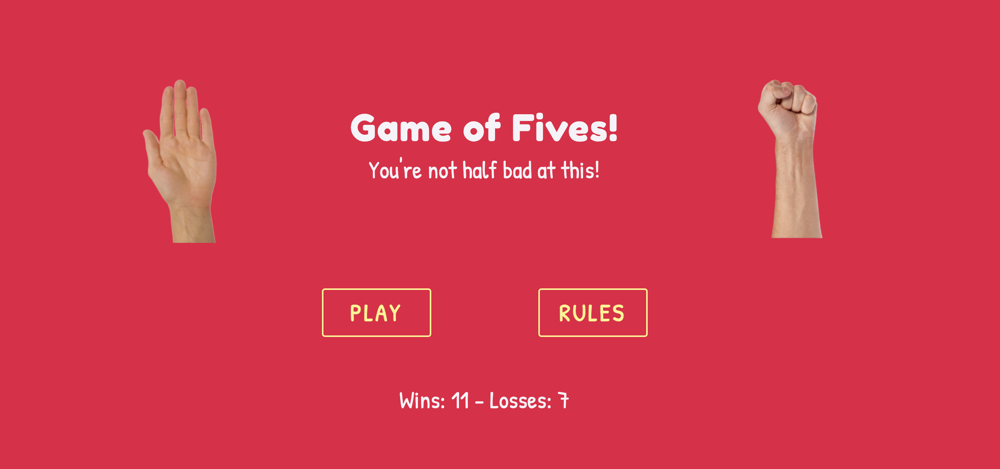
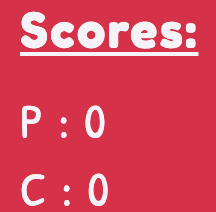
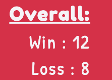

# Testing

Click [here](README.md) to return to the main project.

Testing of this project was carried out through the following methods:

* Constant review during development using Gitpod's browser previewers and Chrome developer tools.
* User testing of the deployed site when close to completion.
* Manual user story testing during and after the writing of the code.
* Automated testing of the HTML, CSS files using the WC3 validators.
* Automated testing of the JavaScript files using JSHINT.
* Automated testing of site's accessibility using the WAVE accessibility tool.

**Note** - Development of this project was my first attempt to follow basic **agile** principals. With help from Trello, I made sure that the project was first built to its most simple iteration - breaking large sections of the code to be written into sprints, with those sprints further broken up into individual tasks to be completed. Each completed task would then usually be assigned to its own git commit so that I had the option to revert to working versions of the code if my game was to break for an unknown reason.

## Table of Contents

* [Testing During Development](#testing-during-development)
   * [Browser Preview and Chrome Developer Tools](#browser-preview-and-chrome-developer-tools)
   * [Post Deployment](#post-deployment)
   * [Notable Bugs](#notable-bugs)
* [User Story Testing](#manual-user-story-testing)
* [Stakeholder Story Testing](#manual-stakeholder-testing)
* [HTML Validator](#html-validator)
* [CSS Validator](#css-validator)
* [JS Validator](#js-validator)
* [Accessibility Testing](#accessibility-testing)

## Testing During Development

### Browser Preview and Chrome Developer Tools

Visuals/Responsiveness

* Testing of the front-end visuals was carried out using Gitpod's browser preview in order to make sure that elements and styles were displaying as intended.
* While on the temporary browser previews, Google Chrome's developer tools were always in use to check the responsiveness of my pages across a number of screen sizes.

Game logic

The guiding principle I followed when writing the game's JavaScript code was to start very simple and build upwards. This way I was able to be reassured that the vital core functions were working properly before added complexity (such as the 3-player and 4-player) versions of the game were attempted. 

The console on Google Chrome's developer tools became my most important means of testing that each small component or task I working on was functioning as intended - using the *console.log* method:

* Initially the most basic 2-player version possible was designed purely for the console. Each specific function would announce to the console that it had been called, and all the relevant variable values were logged using template literals to ensure the functions were acting predictably and following on from each other correctly. 
* Only once I was satisfied that the console version of the game was to specification did I feel comfortable amending the functions to manipulate the HTML of the gamepage itself.
* Any time a function was amended in any way at all, be it to introduce extra layers of complexity or to break code down into more legible sections, I would reintroduce the same *console.log* messages as before to ensure that absolutely nothing had changed as a result of the changes I had made.

Bugs were inevitably present at several stages during development, especially given that this was the first project I had produced using JavaScript. These are covered below in **Notable Bugs.**

### Post Deployment

Several of the same testing methods already listed above were also applied to the live version of the site to ensure that there were no unexpected bugs. On my previous project, I found a few troublesome issues post-deployment that required some time to debug. So for this second project I made sure to deploy the site much earlier to keep on top of any bugs that came in direct contrast to what I was seeing in my development environment.

Once I felt that the project was close to completion, I sent the site's URL to a dozen or so people with instructions to test the game on their available devices. The user testers were given the following instructions:

* Check the rules on the homepage to make sure you understand how to play the game.
* Play at least one game on each of the three difficulties.
* Make a note in the event that the game does not work as you might expect.
* When finished playing, return to the homepage and note down the win vs loss record and the tagline.
* Let me know what device and browser was used.

This structured approach to user testing was in contrast to the slightly looser approach I took with my first project as I had a clearer definition of what answers I need answering at this stage:

* Can a user who has never played the game before work out easily how to play through my explanation of the rules or context?
* Does the game work properly?
* If any issues appear only for a small number or users, what device or browser may be contributing to this issue?

Some important observations were confirmed through the user testing that I would then ensure was implemented on the project itself:

* It was noted that while it was possible to mute sound effects, this was then reverting to default settings once a new game was started. **This was amended to use local storage.**

*One bug in particular with lagging on my sound effects became evident through deployment of the site, this is covered below in **Notable Bugs.***

### Notable bugs

*Duplicate functions when called by click events*

Through my use of *console.log* messages when developing my console-only version of the game, I noticed the functions assigning values to the user's input (the clicking of a fist or palm icon to denote 0 or 5) were being called twice on the second round of the game. This doubling up of the functions would then occur again for the next round, and so on. Evidently, this meant that my game variables were not being updated correctly as a result.

I did a bit of research to understand why this was happening, as in the moment it made no sense for the functions to be called twice. Fortunately the fix was simple to find and implement via the jQuery documentation, as it turns out I simply needed to reset my click events after use. **The .off('click) method fixed the problem by removing the event handler before and after it had been used, thus allowing it to be used again on the next round.** 

*Mute button*

Introducing sound effects to my project was an unfamiliar process and caused a few bugs that needed fixing. I was initially using my game variable (game.soundsOn = true) to decide at each stage whether the sounds should be played - with false being assigned if a user clicked on the mute button. However once I decided to use local storage to assign and store a true or false value for later use, sounds stopped working altogether. It was again through the use of *console.log* that I worked out that the issue was to do with the local storage data being exclusively displayed as strings, instead of actual boolean values. **To fix this, I simply rewrote the necessary sections of my code as strings ("true" or "false" instead of true or false).**

One final problem remained once the sounds were back up and running, in that no sounds would play as a default setting for first time visitors to the gamepage. This it turns out was because I had not told my code what to do if the value on local storage was *null*. **This was fixed with the addition of a simple if statement that ensured sounds.On === "true" in this situation.**

*Animation transform bug*

In order to ensure that the hand images were facing the correct direction on higher difficulty versions of the game, I used the CSS property 'transform' to change the rotation and mirror if necessary. This caused a tricky bug in my animation as it had been written to add and remove an animation class (which also contained the transform property), at intervals - producing the illusion of movement from the hands. The competing transforms, as well as CSS specificity rules, meant that all extra hand images were remaining static during the animation. **This was fixed with help from a video on YouTube (please see acknowledgements in README.md) by using the .animation JS method.**

*Higher difficulty versions displaying minor logic errors*

I inevitably played the game I had created hundreds of times during development and testing, and would always keep an eye out to make sure that the computer was only guessing answers that were logically possible from the inputs it had chosen to make. For example, if any of the computer's inputs were an open palm (5), then it shouldn't logically be guessing 0 on its turn as this answer would not be possible. The idea was that the computer should always have the same chance to guess correctly no matter the difficulty setting, whereas it would become harder for the user to guess correctly the more computer players there were.

While there were no issues on the 2-player version of the game, I did notice that on 3-player the computer was occasionally guessing 15 despite inputting a palm (5) and a fist (0). My if statement was incorrectly written on this occasion to include 15 as a randomly generated option for total inputs of 5 as it included the 4-player version of the game. **This was fixed by rewording the if statement to not include what type of game was being played, but instead focus on the total inputs as a means of determining what answers were possible.**

*Dynamic tagline displaying null for first time users*

Much like my issue with the mute button detailed above, I realised through user testing that the dynamic h2 on the homepage was defaulting to 'null' when a user first entered the site. **This was fixed by including a condition for 'null' in my already existing if statement.** 

*Sound effects on Safari lagging*

A noticeable lag for the sound effects was picked up upon both by myself and other users when playing the game on safari. It was not much, but it was enough to throw off the carefully timed sounds during the game's animation and thus (in my opinion at least) greatly reduce the impact of the animation. The same could be said for the button clicks, the sound effects coming noticeably after a button click had been enacted. This issue was not game-breaking on tablet, laptop or desktops, However it was a really distracting issue on mobile devices - where the lag was so bad that sound effects would pile on top of each other during the animation.

Research online frustratingly did nothing but confirm my suspicion that this issue was mainly rooted in iOS, and that nothing in my code was necessarily broken to cause this issue. I did find on a stack overflow post that two lines of code might help the performance.

const AudioContext = window.AudioContext || window.webkitAudioContext;

const audioCtx = new AudioContext();

This helped the delay on desktop, but unfortunately did nothing to help the delay on mobile devices. **This is therefore a bug which has remained unsolved for now, but I would very much like to come back to this project in the future to fix it if at any point in my career I come across a solution that could help performance on iOS Safari.**

## Manual User Story Testing

Testing my own user stories was carried out using the following criteria:

* The user journey must be intuitive.
* (Where applicable) the user must reach their end destination within three clicks.

### ***1. I want the site navigation to be intuitive so that I can find the game or instructions quickly.***

* Navigation of the site was kept as simple as physically possible, with two large buttons directing to either the game or the rules presented once the page loads and entry animation is complete.

### ***2. I want instructions that explain how to play the game if I don’t know already so that I can quickly learn how to get started.***

* Instructions appear once a user clicks on the rules button on the homepage, **one click.** 
* Once in the rules modal, I made sure there were no more than three slides of information so that finding and learning the rules be completed within three total clicks - **two further clicks.**

* I also asked my user testers to specifically read the rules section of the homepage and feedback if they had any issues at all understanding the mechanics of the game. Most of the feedback suggested that users were able to understand quickly how to play, while a couple of testers said that a combination of the rules explanation and actually playing the game helped them understand how to play properly.

### ***3. I want the game to provide feedback to me during play so that I know when it’s my go, whether I’ve chosen correctly or incorrectly, and what my current score is vs the computer.***

* Each round, the user inputs are only enabled (visually as well as functionally) when the user is allowed to interact with them.

 

* During gameplay, the text content in the centre of the page provides constant feedback about whether the user or computer has guessed correctly or incorrectly through messages:

 

* During gameplay, the scores update to confirm that an answer is indeed correct:

* For an added layer of user feedback, I put in a condition for when the scores had reached 2-2 to alert the user that the next point from either player would be the winning point:

* Finally, when the game is over, feedback is provided to confirm to the user that they have either won or lost this particular game:

 

### ***4. I want to choose the level of difficulty to play on so I can test myself on harder difficulties.***

* A main feature of the game is to decide how many computer players are included during gameplay: 

* Having played hundreds of rounds of this game myself through development, I could tell from my general gut feeling as well as statistics that the 3-player and 4-player games increased the difficulty significantly compared to the basic 2-player game, which effectively amounted to a 50-50 shot at getting the correct answer.

### ***5. I want my wins and losses to be recorded so that when I return to the site I can see historically how successful I am at this game.***

The wins vs loss record is visible in three distinct ways on the site:

* Top right of the game page as a constant reminder of how a player has performed previously:

* Bottom of the homepage:

* In the message presented by the h2 tag on the homepage:

### ***6. I want to enjoy playing the game so that I can justify procrastinating in this way.***

I realise that enjoyment while playing a fairly primitive online game is completely subjective - and accept that this game and its tone will not be for every single user. However the general reception I received from my user testers was very positive, with particular enjoyment somewhat surprisingly coming from the strange sound effects I added. For those who could find the sound effects detrimental to their enjoyment of the game, the mute button is in place to silence them for good if needs be. I certainly feel satisfied that I did all I could during the development of this project to make sure that the game was enjoyable for users to play and consider this user story complete.

### ***7. I want the game to load quickly and respond properly to my interactions as I expect them to.***

* Google Chrome's Lighthouse tool was used to check that performance of the site was up to scratch and achieved a score of 99/100 for the homepage and 100/100 for the game page.
* All logic errors were rectified as and when they appeared, and I feel satisfied that the game functions exactly as I had intended it to from the project's inception.

## Manual Stakeholder Testing

### ***1. I want the site to be eye-catching to look at so that users are left with a positive emotional response and return to the site.***

Once again I am aware that what constitutes a positive emotional response is subjective depending on who is being asked. The site was designed with the core principles of user experience design at the forefront though, and in my opinion is minimalist and intuitive enough for users to navigate easily while being striking to look at.

The bright colour scheme employed should at the very least be memorable, even if I won't automatically assume that would be to everyone's taste.

### ***2. I want users to enjoy the game so that they might recommend it to other people and come back to play more.***

* Please see user story 6.

### ***3. I want the site to function properly and as intended so that I can pass this part of the course.***

* Please see user story 7.

## HTML Validator

### index.html

The initial run of testing on the W3C html validator displayed one warning:

* Empty h2 element, which I decided to disregard as my JavaScript file fills the content of h2 once the page has loaded.

### game.html

No errors or warnings were flagged when the game page was passed through the W3C html validator.

## CSS Validator

No errors were found when running style.css through the W3C CSS validator.

## JS Validator

Using JSHint, I found that there were no critical errors in my written code. There were a few warnings displayed to do with a few missing or unnecessary semicolons, which were promptly rectified.

## Accessibility Testing

Using the WAVE Accessibility Evaluation Tool, I found one error and a few minor warnings in need of fixing and review respectively:

### Error - Empty buttons

I elected to use icons in several of my buttons to add to the visual language of my site without realising that the lack of written content within them amounted to an accessibility error. To fix this, I included the aria-hidden='true' attribute to hide the icon from screen readers, and included the sr-only class to describe what the empty buttons were there to achieve.

*Note - one contrast error was thrown after the inclusion of screen reader only spans within my mute button. I elected to ignore this as I don't believe the inclusion of a screen-reader only span should be subject to contrast requirements.*

### Warnings

* No page regions/headings: The validator picked up on the fact that my pages did not contain the semantic elements that I aim to use in all my projects - however due to this project being game with hardly any definable sections, headers (and headings for the game page) or footers were not deemed necessary.

* Underlined text on the game page: I chose to underline the 'Scores' and 'Overall', which the validator warned could be misconstrued for a highlighted link. I interpreted that it was clear from context that these were not anchor tags and chose to disregard this warning.

[Back to the top](#testing)

[Back to main document](https://github.com/franciskershaw/game-of-fives)